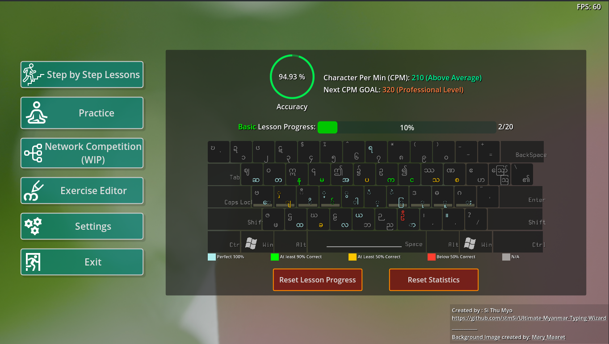

### Ultimate Myanmar Typing Wizard (WIP) 

Created in [Godot Engine 4.0 Stable](https://godotengine.org/download) (Godot 3.x is not supported.)

[Download Linux/Windows Builds](https://github.com/stmSi/Ultimate-Myanmar-Typing-Wizard/releases/)

---

### **Requirements**

* OpenGL 3.3 / OpenGL ES 3.0 compatible hardware
* ***No Need To Install*** Myanmar Unicode Keyboard or Font (Auto Convert English-To-Myanmar )

---

### **Todo**:

1. Better UI Stuff (Proper Menus and stuffs)
2. Optimize the engine build (Remove unnecessary modules... e.g. 3D, Navigation etc. )
3. Mini Games
4. Network Competition
5. ~~User Profile to track progress, stats, frequent mistakes, etc.~~ (Done)
6. Lessons and Exercies
   1. ~~Basic~~ (Done)
   2. Intermediate
   3. Advance
7. Localize UI with Burmese

---

### **Report Issues**:

Feel free to [report](https://github.com/stmSi/Ultimate-Myanmar-Typing-Wizard/issues) any Bugs, Crashes, or Mistakes inside Lessons/Exercises. I will reply and fix as soon as I can.

---

### **Contributions**:

1. Download [Godot Engine 4.0 Stable](https://godotengine.org/download). (Should work in future ***4.x*** versions but ***3.x*** is not supported.)
2. Fork this repo to your github account and `git clone` your forked repo
3. Open `project.godot` with Godot

---

### **Main Menu Screenshot**

---

### **Exercise Editor Screenshot**

---

### **Playground Screenshots**

-------------------------------

MIT License

Copyright (c) 2023 Si Thu Myo <stm1998sithumyo@gmail.com>

Permission is hereby granted, free of charge, to any person obtaining a copy
of this software and associated documentation files (the "Software"), to deal
in the Software without restriction, including without limitation the rights
to use, copy, modify, merge, publish, distribute, sublicense, and/or sell
copies of the Software, and to permit persons to whom the Software is
furnished to do so, subject to the following conditions:

The above copyright notice and this permission notice shall be included in all
copies or substantial portions of the Software.

THE SOFTWARE IS PROVIDED "AS IS", WITHOUT WARRANTY OF ANY KIND, EXPRESS OR
IMPLIED, INCLUDING BUT NOT LIMITED TO THE WARRANTIES OF MERCHANTABILITY,
FITNESS FOR A PARTICULAR PURPOSE AND NONINFRINGEMENT. IN NO EVENT SHALL THE
AUTHORS OR COPYRIGHT HOLDERS BE LIABLE FOR ANY CLAIM, DAMAGES OR OTHER
LIABILITY, WHETHER IN AN ACTION OF CONTRACT, TORT OR OTHERWISE, ARISING FROM,
OUT OF OR IN CONNECTION WITH THE SOFTWARE OR THE USE OR OTHER DEALINGS IN THE
SOFTWARE.
