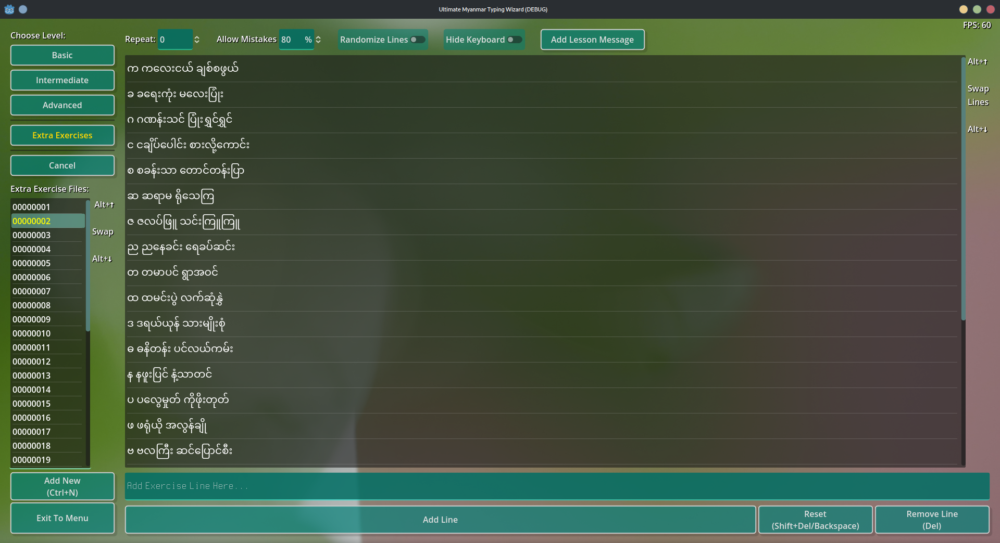

### Ultimate Myanmar Typing Wizard (WIP) 

Created in [Godot Engine 4.0 Stable](https://godotengine.org/download) (Godot 3.x is not supported.)

[Download Windows/Linux Builds](https://github.com/stmSi/Ultimate-Myanmar-Typing-Wizard/releases/tag/pre-build)

### **Requirements**

* OpenGL 3.3 / OpenGL ES 3.0 compatible hardware
* ***No Need To Install*** Myanmar Unicode Keyboard or Font (Auto Convert English-To-Myanmar )

---

### **Exercise Editor Screenshots**

-

---

#### **Playground Screenshots **

-

---

#### **Playground Showcase Video**

https://user-images.githubusercontent.com/32661049/222511307-2d69d482-4424-4706-9908-92767fee9d7d.mp4

---

#### **Exercise Editor Showcase Video**

https://user-images.githubusercontent.com/32661049/222511322-08bec3fa-689e-416e-8c0f-1baf2d4a756f.mp4

---

### **Todo**:

1. Better UI Stuff (Proper Menus and stuffs)
2. Optimize the engine build (Remove unnecessary modules... e.g. 3D, Navigation etc. )
3. Mini Games
4. Network Competition
5. User Profile to track progress, stats, frequent mistakes, etc.
6. Lessons and Exercies
   1. Basic
   2. Intermediate
   3. Advance
