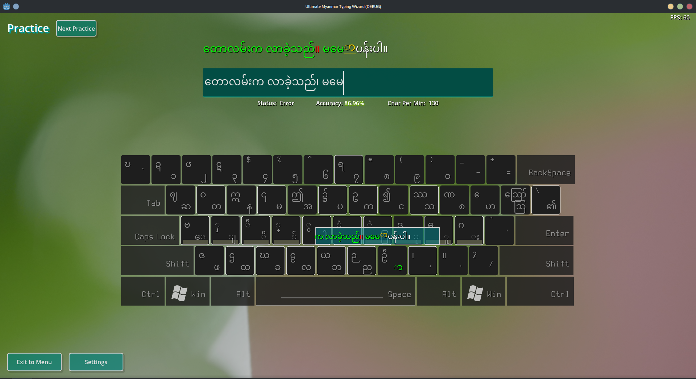

### Ultimate Myanmar Typing Wizard (WIP) 

Created in [Godot Engine 4.0 rc5](https://godotengine.org/article/release-candidate-godot-4-0-rc-5#downloads) (Godot 3.x is not supported.)

---

#### **Showcase Video**

https://user-images.githubusercontent.com/32661049/221483203-988d3664-ff08-438f-bfa3-9f8892a0d101.mp4

---

#### **Playground**

---

### **Exercise Editor**

---

### **Requirements**

* OpenGL (GLES3) compatable device
* ***No Need To Install*** Myanmar Unicode Keyboard (will auto convert eng -> mm)

---

### **Todo**:

1. Better UI Stuff (Proper Menus and stuffs)
2. Optimize the engine build (Remove unnecessary modules... e.g. 3D, Navigation etc. )
3. Mini Games
4. Network Competition
5. User Profile to track progress, stats, frequent mistakes, etc.
6. Lessons and Exercies
   1. Basic
   2. Intermediate
   3. Advance
